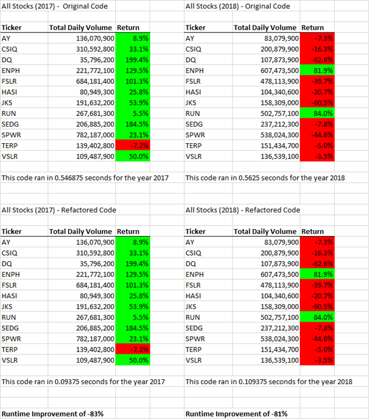
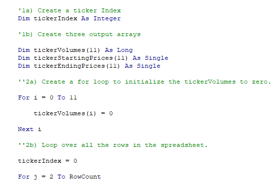
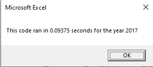
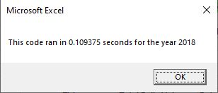

# Stock Analysis

## Project Overview
The purpose of this project is to use Excel VBA to manipulate a large data set and automate repetitive tasks. In this project, we analyzed a data set containing the daily price and trading volume of 12 stocks in 2017 and 2018. The objective is to build an Excel tool that allows the user to easily analyze the performance of stocks by calculating and displaying the annual return and trading volume for a given year.

## Results
The results of the analysis are summarized in the tables below. Several observations can be made:
- The 12 stocks we analyzed generally performed significantly better in 2017 than in 2018, with 11 stocks having positive annual returns in 2017 (highlighted in green in the table), while only two had positive returns in 2018
- There were two exceptions - RUN and TERP, which performed better in 2018
- DQ, the stock we were interested in, had the biggest year-over-year differential. It returned +199% in 2017 and -63% in 2018.
- Total daily volume was similar in both years

Additionally, we refactored the original VBA script by adding three new array vaiables to store values for volume, start price, and end price. Instead of looping through the entire data set 12 times, the refactored code only needs to loop through the data once (see example of code below). As a result, the execution time of the analysis was reduced by over 80%.

 

The Excel data, VBA script, and summary can be found here https://github.com/kristindong/kickstarter-analysis/blob/62e1976782ed354c171c9145852a2a6cb11caa58/Kickstarter_Challenge.zip

## Summary
Refactoring code can improve the efficiency of existing code, which can lead to time and cost savings, as well as better user experience. It can also be used to repurpose existing code for a different task without the need to start from scratch. However, refactoring can be challenging, particularly when the original code is complex. It takes time to rewrite the logic and to debug the new code.

In this project, we refactored our code to use array variables and significantly reduced the code's execution time. The improved efficiency becomes more important as the size of the data set increases. One challenge of refactoring this code was the additional time it took to write and debug the new code. Finally, both the original and refactored code only work when the data is sorted by ticker and date. Further refactoring using more robust logic can be used to address this.
